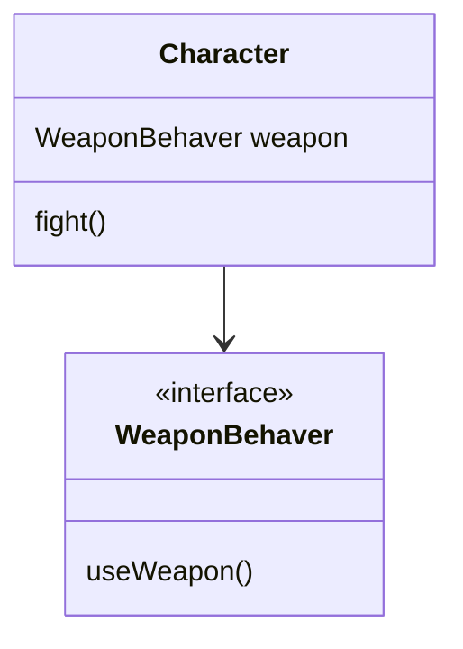
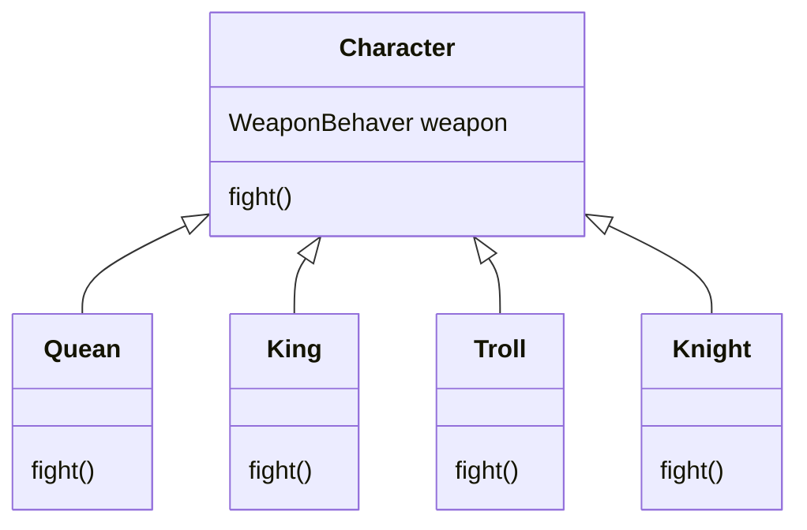
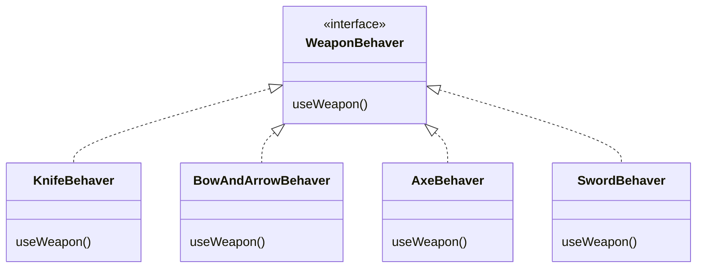

# 策略模式 UML

[toc]

```mermaid
classDiagram
class Character{
WeaponBehaver weapon
fight()
}

class WeaponBehaver{
<<interface>>
useWeapon()
}

Character --> WeaponBehaver
```

## class: Character

```mermaid
classDiagram
class Character{
WeaponBehaver weapon
fight()
}

class Quean{fight()}
class King{fight()}
class Troll{fight()}
class Knight{fight()}

Character <|-- Quean
Character <|-- King
Character <|-- Troll
Character <|-- Knight
```

## interface: WeaponBehaver

```mermaid
classDiagram
class WeaponBehaver{
<<interface>>
useWeapon()
}

class KnifeBehaver{useWeapon()}
class BowAndArrowBehaver{useWeapon()}
class AxeBehaver{useWeapon()}
class SwordBehaver{useWeapon()}

WeaponBehaver <|.. KnifeBehaver
WeaponBehaver <|.. BowAndArrowBehaver
WeaponBehaver <|.. AxeBehaver
WeaponBehaver <|.. SwordBehaver
```
